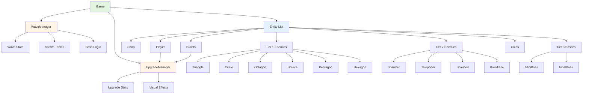

# Design Document - Windowkill Enhancement

## Overview

This design document outlines the technical architecture for enhancing the DaemonWindows multi-window action game. The enhancement builds upon the existing Entity-based inheritance system to add 9 new enemy types, 7 combat upgrades, wave-based spawning, audio/visual effects, and compilation error fixes. The design maintains the current architecture while introducing modular systems for wave management, upgrade handling, and enhanced enemy behaviors.

**Key Design Goals:**
- Maintain existing Entity inheritance architecture
- Introduce modular wave and upgrade systems
- Minimize coupling between new enemy types
- Leverage existing multi-window and collision systems
- Ensure 60 FPS performance with 50+ entities

## Steering Document Alignment

### Technical Standards

**No formal tech.md exists**, but the design follows these observed patterns from the codebase:

- **C++17 Standard**: Using modern C++ features (auto, range-based for loops, smart pointers where appropriate)
- **PascalCase for Classes**: `Entity`, `Player`, `Triangle`, `WaveManager`
- **camelCase for Variables**: `m_health`, `m_position`, `m_spawnTimer`
- **m_ Prefix for Members**: All member variables use `m_` prefix
- **Inheritance-Based Design**: Entity base class with virtual methods
- **Event-Driven Architecture**: Using EventSystem for decoupled communication
- **Manual Memory Management**: Using `GAME_SAFE_RELEASE` template and raw pointers
- **Windows API Integration**: Direct Windows API calls for multi-window management

### Project Structure

**No formal structure.md exists**, but the design follows this observed structure:

```
Code/Game/
├── Framework/          # Application lifecycle, main entry point
│   ├── App.cpp/hpp
│   ├── GameCommon.cpp/hpp
│   └── Main_Windows.cpp
├── Gameplay/           # Game logic, entities, systems
│   ├── Entity.cpp/hpp  # Base class
│   ├── Player.cpp/hpp
│   ├── Game.cpp/hpp    # Main game controller
│   ├── Shop.cpp/hpp
│   ├── [Enemy].cpp/hpp # One file pair per enemy type
│   └── [NEW] WaveManager.cpp/hpp
│   └── [NEW] UpgradeManager.cpp/hpp
└── Subsystem/
    ├── Widget/         # UI components
    └── Window/         # Multi-window management
```

## Code Reuse Analysis

### Existing Components to Leverage

- **Entity Base Class** (`Entity.cpp/hpp`): All new enemy types will inherit from Entity
  - Provides: position, velocity, health, collision radius, window management
  - Virtual methods: `Update()`, `Render()`, `UpdateFromInput()`, `MarkAsDead()`

- **Game Class** (`Game.cpp/hpp`): Central game controller
  - Manages: entity list, game state, collision detection, spawning
  - Will be extended with: wave management, upgrade tracking

- **WindowSubsystem** (`WindowSubsystem.cpp/hpp`): Multi-window management
  - Provides: window creation, positioning, focus management
  - Used by: all entities with `m_hasChildWindow = true`

- **WidgetSubsystem** (`WidgetSubsystem.cpp/hpp`): UI rendering
  - Provides: ButtonWidget for text display
  - Used by: health bars, coin display, shop UI

- **EventSystem** (Engine): Decoupled event communication
  - Existing events: `OnGameStateChanged`, `OnCollisionEnter`, `OnEntityDestroyed`
  - New events: `OnWaveStart`, `OnWaveComplete`, `OnBossSpawn`, `OnUpgradePurchased`

- **AudioSystem** (Engine): Sound playback
  - Provides: `CreateOrGetSound()`, `StartSound()`, `StopSound()`
  - Will be extended with: wave BGM management, per-enemy SFX

- **Collision Detection** (`Game::HandleEntityCollision()`): Disc-based collision
  - Uses: `DoDiscsOverlap2D()` for entity collision checks
  - Will be extended with: new enemy type collision handlers

### Integration Points

- **Entity Spawning**: Extend `Game::SpawnEntity()` to use wave-based spawn tables
- **Collision Handling**: Extend `Game::HandleEntityCollision()` with new enemy type checks
- **Shop System**: Extend `Shop.cpp` to display combat upgrades and refresh functionality
- **Player Stats**: Extend `Player.cpp` with upgrade stat modifiers
- **Bullet Behavior**: Extend `Bullet.cpp` with upgrade-based behavior modifications

## Architecture

### Overall System Architecture

The enhancement introduces two new manager classes (`WaveManager` and `UpgradeManager`) that coordinate with the existing `Game` class. Enemy types remain as independent Entity subclasses. The architecture maintains the current event-driven, inheritance-based design.



### Modular Design Principles

- **Single File Responsibility**: Each enemy type in separate `.cpp/.hpp` file pair
- **Component Isolation**: WaveManager and UpgradeManager are independent, reusable systems
- **Service Layer Separation**:
  - Game logic (Game.cpp)
  - Wave management (WaveManager.cpp)
  - Upgrade management (UpgradeManager.cpp)
  - Entity behaviors (individual enemy files)
- **Utility Modularity**: Shared enemy behaviors (chase player, shoot projectiles) extracted to utility functions

### Design Patterns Used

1. **Inheritance Pattern**: Entity base class with virtual methods
2. **Manager Pattern**: WaveManager and UpgradeManager coordinate subsystems
3. **Observer Pattern**: EventSystem for decoupled communication
4. **Strategy Pattern** (implicit): Different enemy behaviors via virtual Update() methods
5. **Factory Pattern** (implicit): Game::SpawnEntity() creates entities based on type

## Components and Interfaces

### Component 1: WaveManager

- **Purpose:** Manages wave progression, enemy spawning, and boss triggers
- **File Location:** `Code/Game/Gameplay/WaveManager.cpp/hpp`
- **Interfaces:**
  ```cpp
  class WaveManager
  {
  public:
      WaveManager();
      ~WaveManager();

      void Update(float deltaSeconds);
      void StartWave(int waveNumber);
      void CompleteWave();
      bool IsWaveActive() const;
      bool IsBossPhase() const;
      int  GetCurrentWave() const;
      int  GetEnemiesRemaining() const;

      // Spawn logic
      String GetRandomEnemyTypeForWave(int waveNumber);
      String GetBossTypeForWave(int waveNumber);
      int    GetEnemyCountForWave(int waveNumber);

  private:
      int   m_currentWave;
      int   m_enemiesSpawned;
      int   m_enemiesKilled;
      bool  m_isBossPhase;
      bool  m_isWaveActive;
      float m_spawnTimer;
      float m_spawnInterval;

      std::vector<String> m_tier1Enemies;  // Triangle, Circle, Octagon, Square, Pentagon, Hexagon
      std::vector<String> m_tier2Enemies;  // Spawner, Teleporter, Shielded, Kamikaze
      std::vector<String> m_tier3Bosses;   // MiniBoss, FinalBoss
  };
  ```
- **Dependencies:** Game (for entity spawning), EventSystem (for wave events)
- **Reuses:** Existing spawn timer pattern from Game.cpp

### Component 2: UpgradeManager

- **Purpose:** Tracks player upgrades and applies stat modifications
- **File Location:** `Code/Game/Gameplay/UpgradeManager.cpp/hpp`
- **Interfaces:**
  ```cpp
  enum class eUpgradeType : int8_t
  {
      FIRE_RATE,
      DAMAGE,
      PROJECTILE_COUNT,
      BULLET_SPREAD,
      BULLET_SIZE,
      PIERCING,
      HOMING
  };

  struct UpgradeData
  {
      eUpgradeType type;
      int          level;
      int          baseCost;
      String       name;
      String       description;
  };

  class UpgradeManager
  {
  public:
      UpgradeManager();
      ~UpgradeManager();

      void PurchaseUpgrade(eUpgradeType type);
      int  GetUpgradeLevel(eUpgradeType type) const;
      int  GetUpgradeCost(eUpgradeType type) const;

      // Stat getters for Player and Bullet
      float GetFireRateMultiplier() const;
      float GetDamageMultiplier() const;
      int   GetProjectileCount() const;
      float GetBulletSpreadAngle() const;
      float GetBulletSizeMultiplier() const;
      int   GetPiercingCount() const;
      float GetHomingStrength() const;

  private:
      std::map<eUpgradeType, int> m_upgradeLevels;

      int CalculateCost(eUpgradeType type, int level) const;
  };
  ```
- **Dependencies:** Player (for stat application), Bullet (for behavior modification)
- **Reuses:** Existing shop cost pattern from Shop.cpp

### Component 3: Enemy Base Behaviors

**Shared Enemy Utilities** (`Code/Game/Gameplay/EnemyUtils.cpp/hpp`):

```cpp
namespace EnemyUtils
{
    // Movement behaviors
    Vec2 ChasePlayer(Vec2 enemyPos, Vec2 playerPos, float speed, float deltaSeconds);
    Vec2 OrbitPlayer(Vec2 enemyPos, Vec2 playerPos, float radius, float speed, float& angle, float deltaSeconds);
    Vec2 ZigZagToward(Vec2 enemyPos, Vec2 playerPos, float speed, float zigzagAmplitude, float& phase, float deltaSeconds);

    // Combat behaviors
    bool ShouldShootAtPlayer(Vec2 enemyPos, Vec2 playerPos, float range, float cooldown, float& timer);
    Vec2 GetDirectionToPlayer(Vec2 enemyPos, Vec2 playerPos);

    // Spawn behaviors
    Vec2 GetRandomSpawnPosition();
    bool IsPositionValid(Vec2 position, float radius);
}
```

### Component 4: Tier 1 Enemy Types

All Tier 1 enemies inherit from Entity and follow this pattern:

**Triangle (Redesigned)**
- **File:** `Code/Game/Gameplay/Triangle.cpp/hpp`
- **Behavior:** Chase player with moderate speed
- **Stats:** Health 3-5 (scales with wave), Speed 100-150
- **Window:** Separate window with health display

**Circle (Redesigned)**
- **File:** `Code/Game/Gameplay/Circle.cpp/hpp`
- **Behavior:** Orbit player in circular pattern
- **Stats:** Health 2-4, Speed 120
- **Window:** Separate window with health display

**Octagon (Redesigned)**
- **File:** `Code/Game/Gameplay/Octagon.cpp/hpp`
- **Behavior:** Maintain distance, shoot projectiles
- **Stats:** Health 3-5, Speed 80, Shoot Range 300
- **Window:** Separate window with health display

**Square (NEW)**
- **File:** `Code/Game/Gameplay/Square.cpp/hpp`
- **Behavior:** Slow chase, high health
- **Stats:** Health 10-15, Speed 50
- **Window:** Separate window with health display

**Pentagon (NEW)**
- **File:** `Code/Game/Gameplay/Pentagon.cpp/hpp`
- **Behavior:** Fast zigzag movement toward player
- **Stats:** Health 2-3, Speed 200, Zigzag Amplitude 50
- **Window:** Separate window with health display

**Hexagon (NEW)**
- **File:** `Code/Game/Gameplay/Hexagon.cpp/hpp`
- **Behavior:** Chase player, split into 2-3 smaller hexagons on death
- **Stats:** Health 4-6, Speed 100, Split Count 2-3
- **Window:** Separate window with health display
- **Special:** Override `MarkAsDead()` to spawn smaller hexagons

### Component 5: Tier 2 Elite Enemy Types

**Spawner (NEW)**
- **File:** `Code/Game/Gameplay/Spawner.cpp/hpp`
- **Behavior:** Stationary, spawns Tier 1 enemies every 5-10 seconds
- **Stats:** Health 8-12, Spawn Interval 5-10s, Max Spawns 3
- **Window:** Separate window with health display
- **Special:** Timer system for enemy spawning

**Teleporter (NEW)**
- **File:** `Code/Game/Gameplay/Teleporter.cpp/hpp`
- **Behavior:** Teleport to random positions every 2-4 seconds
- **Stats:** Health 4-6, Teleport Interval 2-4s
- **Window:** Separate window with health display
- **Special:** Position randomization with teleport effect

**Shielded (NEW)**
- **File:** `Code/Game/Gameplay/Shielded.cpp/hpp`
- **Behavior:** Chase player, has shield that absorbs hits
- **Stats:** Health 5-8, Shield Health 3-5, Speed 90
- **Window:** Separate window with shield/health display
- **Special:** Dual health system (shield + health)

**Kamikaze (STRETCH)**
- **File:** `Code/Game/Gameplay/Kamikaze.cpp/hpp`
- **Behavior:** Rush toward player at high speed, explode on contact
- **Stats:** Health 2-3, Speed 250, Explosion Radius 100
- **Window:** Separate window with health display
- **Special:** Proximity detection and explosion damage

### Component 6: Tier 3 Boss Enemy Types

**MiniBoss (STRETCH)**
- **File:** `Code/Game/Gameplay/MiniBoss.cpp/hpp`
- **Behavior:** Multi-phase boss with changing attack patterns
- **Stats:** Health 50-100, Speed varies by phase
- **Window:** Dedicated boss window
- **Special:** Phase system based on health percentage

**FinalBoss (STRETCH)**
- **File:** `Code/Game/Gameplay/FinalBoss.cpp/hpp`
- **Behavior:** Complex attack patterns, spawns minions
- **Stats:** Health 150-200, Speed varies by phase
- **Window:** Dedicated boss window
- **Special:** Phase system + minion spawning

### Component 7: Enhanced Shop System

**Shop (Extended)**
- **File:** `Code/Game/Gameplay/Shop.cpp/hpp` (modify existing)
- **New Features:**
  - Display 3 random combat upgrades
  - Refresh button with increasing cost
  - Show upgrade level and cost
  - Visual feedback on purchase
- **New Members:**
  ```cpp
  int m_refreshCost;
  int m_refreshCount;
  std::vector<eUpgradeType> m_currentUpgrades;  // 3 random upgrades
  std::shared_ptr<ButtonWidget> m_refreshButton;
  ```

### Component 8: Enhanced Player System

**Player (Extended)**
- **File:** `Code/Game/Gameplay/Player.cpp/hpp` (modify existing)
- **New Features:**
  - Apply upgrade stat modifiers
  - Visual feedback for active upgrades
- **New Members:**
  ```cpp
  UpgradeManager* m_upgradeManager;  // Reference to game's upgrade manager
  ```
- **Modified Methods:**
  - `FireBullet()`: Apply projectile count, spread, fire rate
  - `Update()`: Apply speed modifiers
  - `Render()`: Show visual upgrade effects

### Component 9: Enhanced Bullet System

**Bullet (Extended)**
- **File:** `Code/Game/Gameplay/Bullet.cpp/hpp` (modify existing)
- **New Features:**
  - Piercing behavior
  - Homing behavior
  - Size scaling
  - Damage scaling
- **New Members:**
  ```cpp
  int   m_damage;
  int   m_piercingCount;
  float m_homingStrength;
  float m_sizeMultiplier;
  int   m_enemiesHit;  // Track for piercing
  ```
- **Modified Methods:**
  - `Update()`: Apply homing logic
  - `Render()`: Apply size scaling
  - Collision handling: Apply piercing logic

### Component 10: Audio Manager

**AudioManager (NEW)**
- **Purpose:** Manage wave-based BGM and enemy SFX
- **File Location:** `Code/Game/Gameplay/AudioManager.cpp/hpp`
- **Interfaces:**
  ```cpp
  class AudioManager
  {
  public:
      AudioManager();
      ~AudioManager();

      void PlayWaveBGM(int waveNumber);
      void PlayWaveStartSFX();
      void PlayWaveCompleteSFX();
      void PlayEnemySpawnSFX(String enemyType);
      void PlayEnemyDeathSFX(String enemyType);
      void PlayBossMusicSFX();
      void PlayUpgradePurchaseSFX();
      void PlayLowHealthWarningSFX();

      void StopCurrentBGM();

  private:
      SoundPlaybackID m_currentBGM;
      std::map<String, SoundID> m_enemySFX;
      std::map<int, SoundID> m_waveBGM;
  };
  ```
- **Dependencies:** AudioSystem (Engine)
- **Reuses:** Existing audio playback pattern from Game.cpp

### Component 11: Particle System

**ParticleSystem (NEW)**
- **Purpose:** Simple particle effects for deaths, impacts, damage
- **File Location:** `Code/Game/Gameplay/ParticleSystem.cpp/hpp`
- **Interfaces:**
  ```cpp
  struct Particle
  {
      Vec2  position;
      Vec2  velocity;
      Rgba8 color;
      float lifetime;
      float maxLifetime;
      float size;
  };

  class ParticleSystem
  {
  public:
      ParticleSystem();
      ~ParticleSystem();

      void Update(float deltaSeconds);
      void Render() const;

      void SpawnDeathParticles(Vec2 position, Rgba8 color, int count);
      void SpawnImpactParticles(Vec2 position, Rgba8 color, int count);
      void SpawnDamageParticles(Vec2 position, Rgba8 color, int count);

  private:
      std::vector<Particle> m_particles;
  };
  ```
- **Dependencies:** Renderer (Engine)
- **Reuses:** Existing rendering system

### Component 12: Game Over System

**Game (Extended for Game Over)**
- **New State:** Add `GAME_OVER` to `eGameState` enum
- **New Members:**
  ```cpp
  int   m_wavesSurvived;
  int   m_enemiesKilled;
  int   m_coinsEarned;
  float m_gameOverTimer;
  ```
- **New Methods:**
  ```cpp
  void TriggerGameOver();
  void RenderGameOver() const;
  void ResetGameStats();
  ```

## Data Models

### Wave Data Model

```cpp
struct WaveData
{
    int                  waveNumber;
    int                  enemyCount;
    float                spawnInterval;
    std::vector<String>  allowedEnemyTypes;
    String               bossType;
    int                  coinReward;
};
```

### Upgrade Data Model

```cpp
struct UpgradeData
{
    eUpgradeType type;
    int          level;
    int          baseCost;
    float        effectPerLevel;
    String       name;
    String       description;
    bool         hasVisualFeedback;
};
```

### Enemy Spawn Table Model

```cpp
struct EnemySpawnEntry
{
    String enemyType;
    int    minWave;        // First wave this enemy can appear
    int    maxWave;        // Last wave this enemy appears (0 = infinite)
    float  spawnWeight;    // Probability weight for random selection
    bool   isBoss;         // Can this enemy be a wave boss?
};
```

### Player Stats Model

```cpp
struct PlayerStats
{
    // Base stats
    float baseSpeed;
    int   baseHealth;
    int   maxHealth;

    // Upgrade modifiers
    float fireRateMultiplier;
    float damageMultiplier;
    int   projectileCount;
    float bulletSpreadAngle;
    float bulletSizeMultiplier;
    int   piercingCount;
    float homingStrength;
};
```

### Game Statistics Model

```cpp
struct GameStatistics
{
    int wavesSurvived;
    int enemiesKilled;
    int coinsEarned;
    int upgradesPurchased;
    float survivalTime;
};
```

## Error Handling

### Error Scenarios

1. **Scenario: Enemy Spawn Failure**
   - **Cause:** Invalid spawn position, no valid enemy types for wave
   - **Handling:** Log warning, skip spawn, continue wave
   - **User Impact:** Slightly fewer enemies in wave (not noticeable)

2. **Scenario: Upgrade Purchase with Insufficient Coins**
   - **Cause:** Player clicks upgrade button without enough coins
   - **Handling:** Play error sound, disable button, show visual feedback
   - **User Impact:** Button disabled, no purchase occurs

3. **Scenario: Shop Refresh with Insufficient Coins**
   - **Cause:** Player clicks refresh button without enough coins
   - **Handling:** Disable refresh button, show cost in red
   - **User Impact:** Cannot refresh shop until more coins earned

4. **Scenario: Boss Spawn Failure**
   - **Cause:** No valid boss type for current wave
   - **Handling:** Spawn strongest Tier 2 enemy as fallback boss
   - **User Impact:** Wave still has boss, slightly different behavior

5. **Scenario: Audio File Missing**
   - **Cause:** SFX or BGM file not found
   - **Handling:** Log error, continue without audio
   - **User Impact:** Silent gameplay (not ideal but not crash)

6. **Scenario: Window Creation Failure**
   - **Cause:** Too many windows, system resources exhausted
   - **Handling:** Spawn enemy without child window
   - **User Impact:** Enemy appears in main window instead

7. **Scenario: Hexagon Split Spawn Failure**
   - **Cause:** No space for smaller hexagons
   - **Handling:** Skip split, drop coins normally
   - **User Impact:** No split occurs, normal death

8. **Scenario: Particle System Overflow**
   - **Cause:** Too many particles spawned simultaneously
   - **Handling:** Cap particle count at 1000, remove oldest
   - **User Impact:** Slightly reduced visual effects

## Compilation Error Fixes

### Fix 1: OpenSSL Linking Errors

**Problem:** 26 unresolved external symbols for OpenSSL functions (CRYPTO_free, BIO_*, EVP_*, etc.)

**Solution:** Add OpenSSL libraries to project configuration

**Implementation:**
1. Open `Code/Game/Game.vcxproj` in text editor
2. Locate `<AdditionalLibraryDirectories>` tags for Debug and Release configurations
3. Add OpenSSL library path:
   ```xml
   <AdditionalLibraryDirectories>
       $(SolutionDir)Code/;
       $(SolutionDir)../Engine/Code/;
       $(SolutionDir)../Engine/Code/ThirdParty/openssl/lib/x64/$(Configuration);
       %(AdditionalLibraryDirectories)
   </AdditionalLibraryDirectories>
   ```
4. Locate `<AdditionalDependencies>` tags
5. Add OpenSSL libraries:
   ```xml
   <AdditionalDependencies>
       libcrypto.lib;
       libssl.lib;
       winmm.lib;
       dbghelp.lib;
       shlwapi.lib;
       %(AdditionalDependencies)
   </AdditionalDependencies>
   ```

**Reference:** `C:\GitHub\Protogame2D\Code\Game\Game.vcxproj` (lines with OpenSSL configuration)

### Fix 2: Duplicate g_widgetSubsystem Symbol

**Problem:** LNK2005 error - `g_widgetSubsystem` defined in both App.obj and Engine_x64_Debug.lib(EngineCommon.obj)

**Solution:** Ensure proper extern declaration pattern

**Implementation:**
1. Verify `Code/Game/Framework/GameCommon.hpp` has extern declaration:
   ```cpp
   extern WidgetSubsystem* g_widgetSubsystem;
   ```
2. Verify `Code/Game/Framework/App.cpp` has single definition:
   ```cpp
   WidgetSubsystem* g_widgetSubsystem = nullptr;
   ```
3. Check Engine's `EngineCommon.cpp` - if it also defines `g_widgetSubsystem`, remove it
4. Engine should only declare (extern), not define

**Reference:** `C:\GitHub\Protogame2D` project structure (verified working pattern)

## Testing Strategy

### Manual Testing Approach

Since automated testing is not required for DFS2, all testing will be manual verification:

### Unit Testing (Manual)

**Enemy Behavior Testing:**
- Spawn each enemy type individually
- Verify movement pattern matches design
- Verify health scaling with wave number
- Verify coin drops on death
- Verify window creation and display

**Upgrade Testing:**
- Purchase each upgrade type
- Verify stat changes apply correctly
- Verify visual feedback appears
- Verify cost increases correctly
- Verify stacking works (purchase multiple times)

**Wave System Testing:**
- Start wave 1, verify only Tier 1 enemies spawn
- Progress to wave 2-5, verify Tier 1 + Tier 2 mix
- Progress to wave 6+, verify all enemy types
- Verify boss spawns after regular enemies cleared
- Verify wave completion triggers next wave

### Integration Testing (Manual)

**Combat Flow Testing:**
- Player shoots enemies with various upgrades
- Verify piercing bullets hit multiple enemies
- Verify homing bullets track enemies
- Verify damage scaling kills enemies faster
- Verify projectile count fires multiple bullets

**Shop Flow Testing:**
- Open shop during gameplay
- Purchase upgrades
- Refresh shop
- Verify coin deduction
- Verify upgrade application to player

**Wave Progression Testing:**
- Play through multiple waves
- Verify difficulty increases
- Verify boss battles work
- Verify wave completion rewards
- Verify game over on player death

### End-to-End Testing (Manual)

**Full Gameplay Session:**
1. Start game from attract mode
2. Play through 10+ waves
3. Purchase various upgrades
4. Fight multiple boss types
5. Verify no crashes for 10+ minutes
6. Verify 60 FPS maintained
7. Verify audio plays correctly
8. Verify visual effects appear
9. Die and verify game over screen
10. Return to attract mode

**Performance Testing:**
- Spawn 50+ entities on screen
- Verify frame rate stays above 60 FPS
- Verify no memory leaks over extended play
- Verify window management remains stable

**Edge Case Testing:**
- Purchase all upgrades to high levels
- Spawn maximum enemy count
- Test with multiple windows open
- Test window focus switching
- Test rapid shop refresh
- Test hexagon split with many entities

## Implementation Phases

### Phase 1: Foundation (Sprint 1)
- Fix compilation errors
- Code refactoring and cleanup
- Create WaveManager skeleton
- Create UpgradeManager skeleton

### Phase 2: Tier 1 Enemies (Sprint 2)
- Implement Square, Pentagon, Hexagon
- Redesign Triangle, Circle, Octagon behaviors
- Create EnemyUtils shared behaviors
- Test enemy spawning and behaviors

### Phase 3: Tier 2 Enemies & Wave System (Sprint 3)
- Implement Spawner, Teleporter, Shielded
- Complete WaveManager implementation
- Implement wave progression logic
- Implement boss spawn system
- Test wave flow

### Phase 4: Combat Upgrades (Sprint 4)
- Complete UpgradeManager implementation
- Extend Shop with refresh system
- Extend Player with upgrade application
- Extend Bullet with upgrade behaviors
- Test all 7 upgrades

### Phase 5: Audio & Visual Polish (Sprint 5)
- Implement AudioManager
- Implement ParticleSystem
- Add SFX for all enemy types
- Add BGM for waves
- Add visual upgrade feedback
- Test audio/visual systems

### Phase 6: Game Over & Polish (Sprint 6)
- Implement game over system
- Add statistics tracking
- Bug fixes and optimization
- Final testing and polish

### Phase 7-8: Stretch Goals (Beyond Semester)
- Implement Kamikaze enemy
- Implement Mini-Boss and Final Boss
- Implement menu system
- Implement endless mode

## Performance Considerations

### Optimization Strategies

1. **Entity Pooling** (if needed):
   - Reuse entity objects instead of constant new/delete
   - Reduce memory allocation overhead

2. **Collision Optimization**:
   - Spatial partitioning for large entity counts
   - Early-out checks for distant entities

3. **Particle Culling**:
   - Cap maximum particle count at 1000
   - Remove particles outside screen bounds

4. **Audio Optimization**:
   - Limit simultaneous sound effects
   - Use sound pooling for repeated SFX

5. **Window Management**:
   - Limit maximum child windows (e.g., 20)
   - Reuse windows when possible

### Performance Targets

- **Frame Rate:** 60 FPS with 50+ entities
- **Memory:** No leaks during 10+ minute sessions
- **Load Time:** < 2 seconds to start game
- **Window Creation:** < 100ms per window

## Approval

This design document will be reviewed and approved before proceeding to the tasks phase. Approval will be managed through the spec-workflow approval system.

**Approval Status:** Pending Review

**Next Steps After Approval:**
1. Create tasks.md with detailed implementation tasks
2. Begin Sprint 1 implementation
3. Track progress through spec-workflow system
