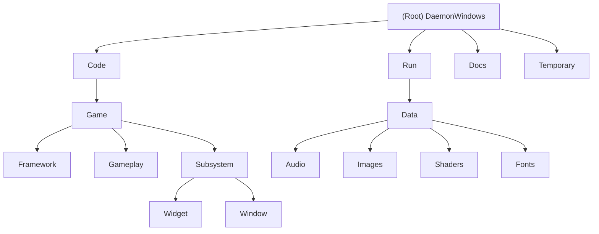

# DaemonWindows - Multi-Window Action Game Engine

## Changelog
- **2025-09-18**: Updated AI context documentation, verified comprehensive project structure and module coverage
- **2025-09-10**: Initial AI context documentation generated, comprehensive project structure analysis completed

## Project Vision

DaemonWindows is an innovative C++ game engine application that transforms the traditional Windows desktop environment into a dynamic gaming battlefield. The project explores unconventional game design by utilizing advanced Windows API features to create an immersive multi-window gaming experience that extends beyond typical single-window constraints.

## Architecture Overview

This project implements a sophisticated multi-window game engine with the following key architectural components:

- **Custom Game Framework**: Built on a proprietary Daemon Engine with Windows API integration
- **Multi-Window Management System**: Advanced window creation, positioning, and animation capabilities  
- **Entity-Component System**: Flexible game object architecture supporting cross-window entity management
- **Subsystem Architecture**: Modular design with Widget and Window subsystems
- **DirectX 11 Rendering Pipeline**: Hardware-accelerated 2D sprite rendering with cross-window support

## Module Structure Diagram

## Module Index

| Module | Path | Type | Responsibilities |
|--------|------|------|------------------|
| **Framework** | `Code/Game/Framework/` | Application Framework | Application lifecycle, Windows API integration, main entry point |
| **Gameplay** | `Code/Game/Gameplay/` | Game Logic System | Game state management, entity system, player mechanics, shop system |
| **Widget Subsystem** | `Code/Game/Subsystem/Widget/` | UI Management | Widget rendering, UI event handling, interface components |
| **Window Subsystem** | `Code/Game/Subsystem/Window/` | Multi-Window Engine | Window creation, positioning, animation, cross-window entity management |
| **Runtime Assets** | `Run/` | Asset Directory | Game assets, executables, runtime dependencies |

## Running and Development

### Prerequisites
- **Visual Studio 2022** or later with C++ development tools
- **Windows 10 SDK** (10.0.19041.0 or later)  
- **DirectX 11** compatible graphics card
- **Windows 10/11** (required for advanced window management features)
- **External Daemon Engine** dependency (located at `../Engine/`)

### Build Process
1. Open `DaemonWindows.sln` in Visual Studio
2. Ensure Engine dependency is available at `../Engine/Code/Engine/`
3. Set platform to `x64` and choose `Debug` or `Release` configuration
4. Build solution (`Ctrl+Shift+B`)
5. Executable will be copied to `Run/` directory automatically

### Game Controls
- **Attract Mode**: SPACE (enter game), ESC (exit)
- **Game Mode**: WASD (movement), Left Mouse (shoot), SPACE (shop), ESC (attract mode)
- **Shop Mode**: 1/2/3 (upgrades), ESC (return to game)

## Testing Strategy

Currently, the project lacks dedicated automated testing infrastructure. Recommended testing approach:

- **Manual Integration Testing**: Multi-window functionality across different Windows versions
- **Performance Testing**: Frame rate monitoring with high entity counts across multiple windows
- **Compatibility Testing**: Various screen resolutions and multi-monitor setups
- **Memory Testing**: Entity lifecycle and window management memory usage

## Coding Standards

- **Language**: C++17 standard with Visual Studio 2022 toolset
- **Naming Convention**: PascalCase for classes, camelCase for variables, m_ prefix for member variables
- **Memory Management**: Custom `GAME_SAFE_RELEASE` template for cleanup, RAII principles
- **Architecture**: Entity-based design with subsystem modularity
- **Platform Integration**: Windows API best practices for multi-window management

## AI Usage Guidelines

When working with this codebase:

1. **Respect External Dependencies**: The Engine module is external - do not attempt to modify Engine code
2. **Window Management Focus**: Pay special attention to multi-window synchronization and entity cross-window movement
3. **Memory Safety**: Follow existing memory management patterns using custom cleanup macros  
4. **Performance Considerations**: Multi-window rendering requires careful resource management
5. **Platform Specificity**: This is a Windows-specific application using native APIs

## Key Technical Highlights

- **Advanced Window Management**: Custom WindowSubsystem with animation support and entity ownership tracking
- **Cross-Window Entity System**: Entities can move seamlessly between multiple game windows
- **Widget-Based UI**: Flexible UI system supporting complex interface layouts
- **Asset Pipeline Integration**: Comprehensive asset management for audio, graphics, and shaders
- **Performance Optimization**: Entity pooling and efficient collision detection across windows